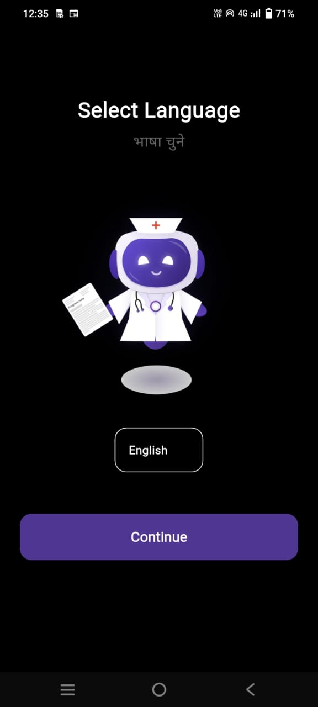
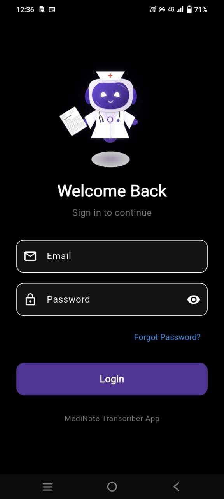
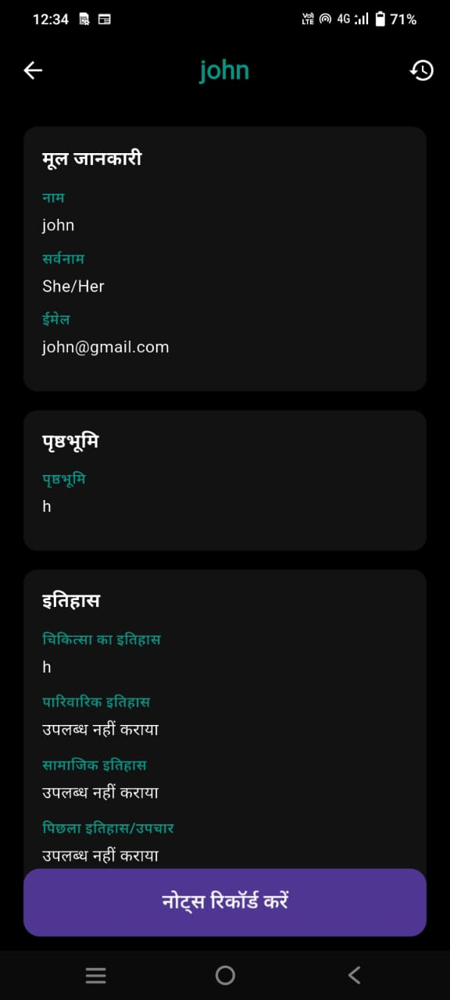
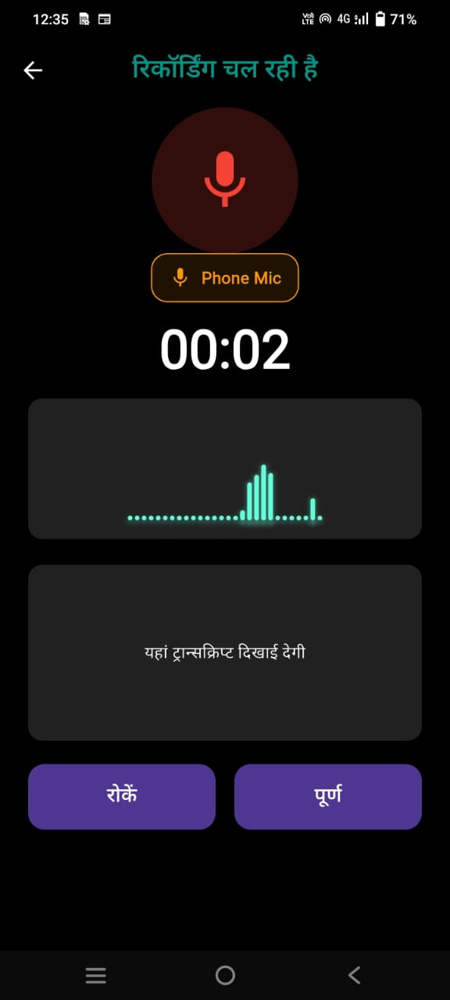
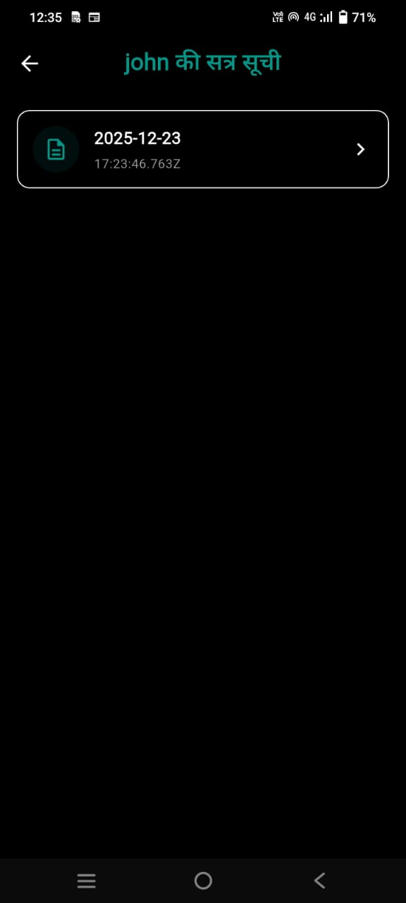
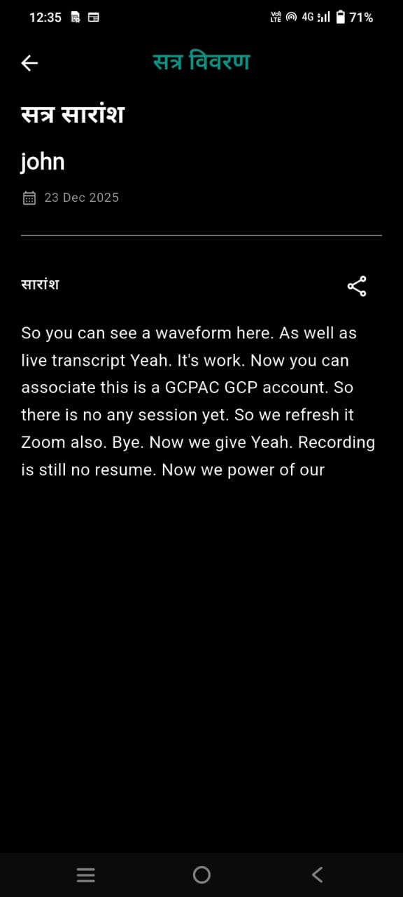
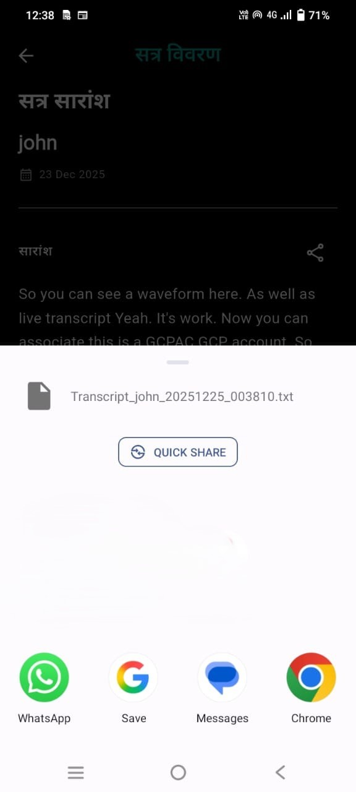
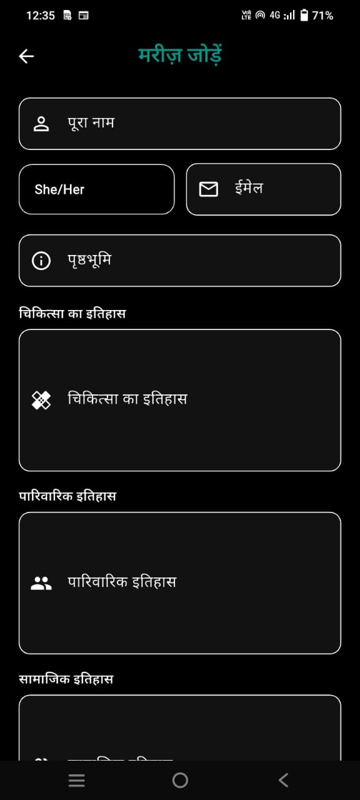
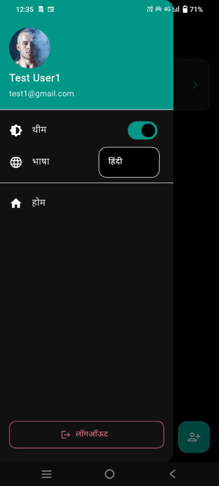
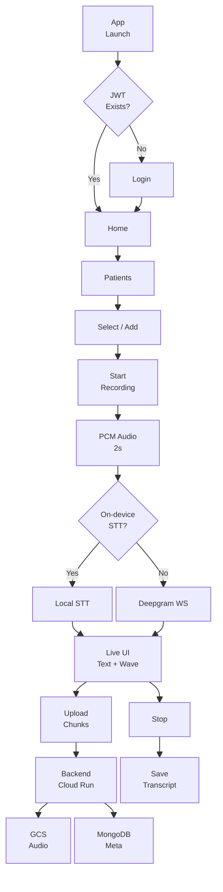

# 📝 Medi-Note – Flutter Application

Medi-Note is a Flutter-based mobile application that allows users to manage patient notes, record audio, and generate **real-time medical transcriptions** using Deepgram.  
The app is integrated with a **Node.js backend deployed on Google Cloud Run**.

---

## 📸 Screenshots

| Select Language Screen | Select Theme Screen | Login Screen | Home Screen |
|---|---|---|---|
|  |  |   |  |

| Patient Details Screen | Recording Screen | Session Screen | Session Details Screen |
|---|---|---|---|
|  | | | |

| Share Transcript | New Patient Add Screen | Drawar Settings |
|---|---|---|
|  | | |
---

## 🚀 Features

- 🔐 User Authentication (JWT-based)
- 👨‍⚕️ Patient Management
- 🎙️ Real-time Audio Recording based on 2sec audio chunk.
- 🧠 Real-time Transcription using **speech_to_text** package
- 🧠 Deepgram websocket is also implement as backup for live transcript you can use them **Deepgram**
- ☁️ Backend hosted on **Google Cloud Run**
- 📦 Dockerized backend
- 📱 Android & iOS support

---

## 🔄 Application Flow Diagram



---

## 📱 Android APK Download

👉 **Download APK (Release Build)**  
[APK Link](https://drive.google.com/file/d/1wTBWVN-ynq5NkfEGvf8nOdtLXXOzLwMq/view?usp=sharing)

> Download the latest `app-release.apk` from this Google Drive link Releases and install it on your Android device.

---

## 🎥 Demo Video (Loom)

👉 **Demo Video (All Features)**  
[Video Link](https://www.loom.com/share/c1dd7be72edd40e69e2e2eaa139a2271)

> This video demonstrates authentication, patient flow, audio recording, and transcription.

---

## 🌐 Backend Deployment URL

The backend API is deployed on **Google Cloud Run**: **BaseUrl:**  [BaseUrl](
https://medinote-backend-staging-520509474930.asia-south1.run.app)

---

## 📚 API Documentation

👉 **Postman API Documentation**  [Documentation](https://documenter.getpostman.com/view/46799365/2sB3dWpkuz)

> Contains detailed request/response examples for all APIs.

---

## 🔧 Postman Collection

👉 **Download Postman Collection**  
[collection](https://github.com/aniketmmaind/medi-note-api-assign/blob/main/postman/medi-note-API-doc-postman-collection.json)

---

## Backend Code Git Repo

The backend git repo: [API Repo](https://github.com/aniketmmaind/medi-note-api-assign)

---

## 🔑 Environment Configuration for Flutter Project

Create a `.env` file at the root of the Flutter project:

```env
BASE_URL=BaseUrl provided
DEEPGRAM_API_KEY=YOUR_DEEPGRAM_API_KEY
```

---

## 🧠 Real-Time Transcription (Deepgram)

The app uses Deepgram for real-time speech-to-text during audio recording.

- Console: <https://console.deepgram.com>
- Create an API key
- Add it to `.env` as `DEEPGRAM_API_KEY`

---

## 🛠️ Flutter Version

```cmd
flutter --version
```

```output:```

```ver
Flutter 3.29.1 • channel stable • https://github.com/flutter/flutter.git
Framework • revision 09de023485 (10 months ago) • 2025-02-28 13:44:05 -0800
Engine • revision 871f65ac1b
Tools • Dart 3.7.0 • DevTools 2.42.2
```

---

## ▶️ Run the App Locally

```flutter
flutter clean
flutter pub get
flutter run
```

#### For release APK

```rel
flutter build apk --release
```

#### Generated APK Path

```build/app/outputs/flutter-apk/app-release.apk```

## 📦 Codemagic Build Artifacts

Google Drive : [Link](https://drive.google.com/drive/folders/1S1g6-VzW8wXWLMY68d8C5cDtdWuyj6QS?usp=sharing)

- Android APK
- Web Build ZIP

---

## 🏗️ Backend Integration Overview

- Backend built with Node.js + Express
- MongoDB Atlas for database
- JWT authentication
- Google Cloud Storage for audio chunks
- Deployed using Docker + Cloud Run

---

### 📌 Notes for Reviewers

- Secrets and credentials are excluded from the repository
- Backend is fully dockerized
- One-command backend deployment using ```docker-compose up --build```
- Cloud Run revisions used for versioning
